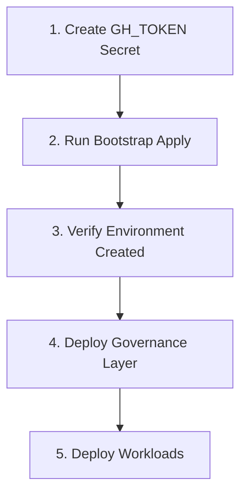
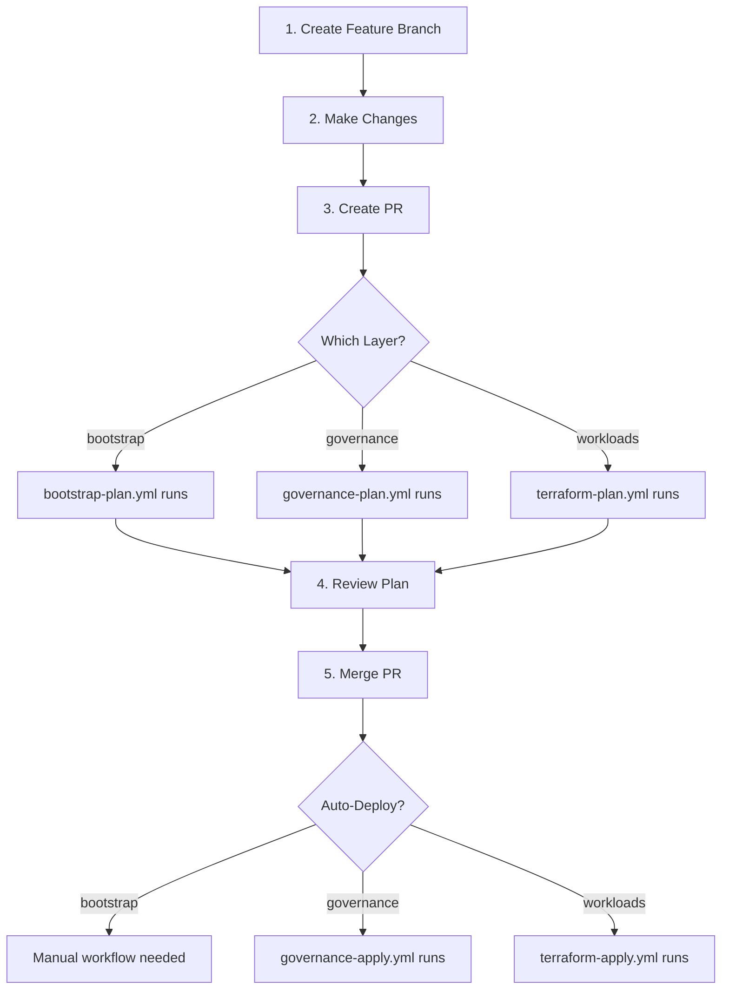

# Workflow Summary

## Quick Reference

### Bootstrap Layer (alz-level-0)
```bash
# Plan (automatic on PR)
PR to main with alz-level-0/** changes → bootstrap-plan.yml

# Apply (manual)
Actions → Bootstrap Apply → Environment: dev/staging/prod → Type "bootstrap"

# Destroy (manual)
Actions → Bootstrap Destroy → Environment: dev/staging/prod → Type "destroy-bootstrap"
```

### Governance Layer (alz-layer-1)
```bash
# Plan (automatic on PR)
PR to main with alz-layer-1/** changes → governance-plan.yml

# Apply (automatic on merge)
Merge PR to main → governance-apply.yml (dev only)
```

### Workload Layer (terraform/)
```bash
# Plan (automatic on PR)
PR to main with terraform/** changes → terraform-plan.yml

# Apply Dev (automatic on merge)
Merge PR to main → terraform-apply.yml (dev)

# Deploy Staging/Prod (manual)
Actions → Terraform Deploy → Environment: staging/prod

# Destroy (manual)
Actions → Terraform Destroy → Environment: dev/staging/prod
```

## Workflow Matrix

| Layer | Plan | Apply Dev | Apply Staging | Apply Prod | Destroy |
|-------|------|-----------|---------------|------------|---------|
| **Bootstrap** | Auto (PR) | Manual ⚠️ | Manual ⚠️ | Manual ⚠️ | Manual ⚠️ |
| **Governance** | Auto (PR) | Auto (Merge) | N/A | N/A | N/A |
| **Workloads** | Auto (PR) | Auto (Merge) | Manual 🔒 | Manual 🔒🔒 | Manual ⚠️ |

**Legend:**
- Auto = Automatic trigger
- Manual = workflow_dispatch
- ⚠️ = Requires typed confirmation
- 🔒 = Requires 1 approval
- 🔒🔒 = Requires 2 approvals

## State Management

| Layer | Backend | State Location | Notes |
|-------|---------|----------------|-------|
| **alz-level-0** | Local (default) | `.terraform/` | Can migrate to remote after bootstrap |
| **alz-layer-1** | None | N/A | Policies don't require shared state |
| **terraform/** | Azure Storage | `nautilustfstate{env}` | Created by bootstrap |

## Required Secrets Setup

### Step 1: Create Repository Secret
```bash
Settings → Secrets → Actions → New repository secret
Name: GH_TOKEN
Value: ghp_... (GitHub PAT with repo scope)
```

### Step 2: Run Bootstrap (Creates Environment Secrets)
```bash
Actions → Bootstrap Apply → Run workflow
Environment: dev
Confirmation: bootstrap
```

### Step 3: Verify Environment Secrets Created
```bash
Settings → Environments → dev → Secrets
✓ ARM_CLIENT_ID
✓ ARM_TENANT_ID  
✓ ARM_SUBSCRIPTION_ID
```

## Deployment Order

### First Time (Cold Start)


### Normal Development


## Common Workflows

### Deploy New Environment
```bash
# 1. Deploy bootstrap for new environment
Actions → Bootstrap Apply
Environment: staging
Confirmation: bootstrap

# 2. Deploy governance (edit alz-layer-1/terraform.tfvars for staging)
# Not needed if governance is subscription-level

# 3. Deploy workloads
Actions → Terraform Deploy
Environment: staging
```

### Update Policies
```bash
# 1. Edit alz-layer-1/policy-config.tf
git checkout -b update-policies
# Make changes
git commit -am "feat: update policy assignments"
git push

# 2. Create PR
# governance-plan.yml runs automatically

# 3. Review and merge
# governance-apply.yml deploys to dev automatically
```

### Rollback Workload
```bash
# 1. Revert commit
git revert <commit-hash>
git push origin main

# 2. Auto-deploys to dev
# terraform-apply.yml runs

# 3. Deploy to staging/prod if needed
Actions → Terraform Deploy
```

### Destroy Everything
```bash
# CAUTION: Reverse order!

# 1. Destroy workloads
Actions → Terraform Destroy
Environment: dev
Confirmation: Type environment name

# 2. Destroy governance (manual)
cd alz-layer-1
terraform destroy

# 3. Destroy bootstrap (LAST!)
Actions → Bootstrap Destroy
Environment: dev
Confirmation: destroy-bootstrap
```

## Tips & Tricks

### Faster Iteration in Dev
```bash
# Skip PR for quick dev testing
git commit -am "quick test"
git push origin main
# Auto-deploys via terraform-apply.yml
```

### Debug Workflow Issues
```bash
# Check workflow logs
Actions → [Workflow Run] → [Job] → [Step]

# Check Terraform state
az storage blob list --account-name nautilustfstatedev \
  --container-name tfstate --auth-mode login
```

### Update Bootstrap Configuration
```bash
# 1. Edit alz-level-0/main.tf or variables
# 2. Create PR → bootstrap-plan.yml runs
# 3. Merge PR
# 4. Manually trigger Bootstrap Apply workflow
```

### Test Workflow Locally
```bash
# Install act (GitHub Actions local runner)
brew install act

# Run workflow locally
act pull_request -W .github/workflows/bootstrap-plan.yml
```

## Workflow Monitoring

### GitHub UI
```
Repository → Actions → [Workflow] → [Run]
- View logs
- Re-run jobs
- Download artifacts
```

### Notifications
```
Repository → Settings → Notifications
- Email on workflow failure
- Slack integration
- GitHub mobile app
```

### Status Badges
Add to README.md:
```markdown


```
