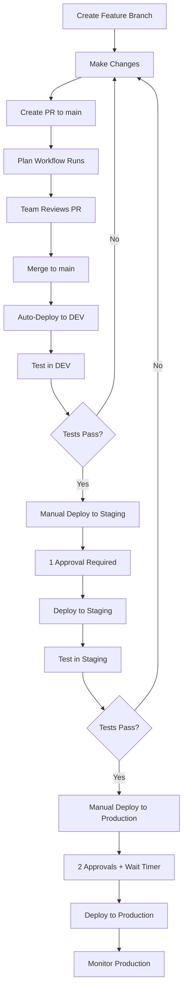

# Multi-Environment Deployment Guide

This guide explains how to configure and use the multi-environment deployment setup for the Nautilus Terraform project.

## Overview

The project supports three environments:
- **Dev** - Development environment (auto-deploy on merge to main)
- **Staging** - Staging environment (requires 1 approval)
- **Production** - Production environment (requires 2 approvals + wait timer)

## Environment Configuration

### 1. Create GitHub Environments

Navigate to your repository: `Settings → Environments → New environment`

#### Dev Environment
1. Click "New environment"
2. Name: `dev`
3. **No protection rules** (auto-deploy)
4. Click "Configure environment"
5. Add environment secrets (see section below)

#### Staging Environment
1. Click "New environment"
2. Name: `staging`
3. Configure protection rules:
   - ✅ **Required reviewers**: Add 1 team member
   - ⬜ Wait timer: 0 minutes
   - ⬜ Deployment branches: All branches (or limit to `main`)
4. Add environment secrets (see section below)

#### Production Environment
1. Click "New environment"
2. Name: `production`
3. Configure protection rules:
   - ✅ **Required reviewers**: Add 2 senior team members
   - ✅ **Wait timer**: 30 minutes (optional, for change windows)
   - ✅ **Deployment branches**: Selected branches → `main` only
4. Add environment secrets (see section below)

### 2. Configure Environment Secrets

For **each environment** (dev, staging, production), add these secrets:

Go to: `Settings → Environments → [environment-name] → Environment secrets`

Required secrets:
- `ARM_CLIENT_ID` - Azure App Registration Client ID
- `ARM_TENANT_ID` - Azure Tenant ID  
- `ARM_SUBSCRIPTION_ID` - Azure Subscription ID

**Important**: Each environment should have its own Azure subscription or at minimum, different resource groups.

#### Example Values:

**Dev Environment:**
```
ARM_CLIENT_ID: 12345678-1234-1234-1234-123456789abc
ARM_TENANT_ID: 87654321-4321-4321-4321-cba987654321
ARM_SUBSCRIPTION_ID: 11111111-1111-1111-1111-111111111111
```

**Staging Environment:**
```
ARM_CLIENT_ID: 12345678-1234-1234-1234-123456789abc
ARM_TENANT_ID: 87654321-4321-4321-4321-cba987654321
ARM_SUBSCRIPTION_ID: 22222222-2222-2222-2222-222222222222
```

**Production Environment:**
```
ARM_CLIENT_ID: 12345678-1234-1234-1234-123456789abc
ARM_TENANT_ID: 87654321-4321-4321-4321-cba987654321
ARM_SUBSCRIPTION_ID: 33333333-3333-3333-3333-333333333333
```

### 3. Configure Azure OIDC Federated Credentials

You need to create federated credentials for each environment. See [OIDC_SETUP.md](OIDC_SETUP.md) for detailed instructions.

For the deployment workflow, add this federated credential:

```bash
APP_ID="<your-app-id>"

# For environment-specific deployments
az ad app federated-credential create \
  --id $APP_ID \
  --parameters '{
    "name": "GitHub-Nautilus-Environment-Deploy",
    "issuer": "https://token.actions.githubusercontent.com",
    "subject": "repo:wots-mi/nautilus:environment:dev",
    "description": "GitHub Actions environment deployments",
    "audiences": ["api://AzureADTokenExchange"]
  }'

# Repeat for staging and production
az ad app federated-credential create \
  --id $APP_ID \
  --parameters '{
    "name": "GitHub-Nautilus-Environment-Staging",
    "issuer": "https://token.actions.githubusercontent.com",
    "subject": "repo:wots-mi/nautilus:environment:staging",
    "description": "GitHub Actions staging deployments",
    "audiences": ["api://AzureADTokenExchange"]
  }'

az ad app federated-credential create \
  --id $APP_ID \
  --parameters '{
    "name": "GitHub-Nautilus-Environment-Production",
    "issuer": "https://token.actions.githubusercontent.com",
    "subject": "repo:wots-mi/nautilus:environment:production",
    "description": "GitHub Actions production deployments",
    "audiences": ["api://AzureADTokenExchange"]
  }'
```

## Deployment Workflows

### Automatic Deployment (Dev Only)

**When:** Merge PR to `main` branch

**What happens:**
1. PR merged to `main`
2. `terraform-apply.yml` workflow runs automatically
3. Deploys to **dev environment** using `terraform.dev.tfvars`
4. No approval required

### Manual Deployment (All Environments)

**When:** You want to deploy to specific environment

**How to deploy:**
1. Go to `Actions` tab
2. Click "Deploy to Environment" workflow
3. Click "Run workflow"
4. Select:
   - **Environment**: dev / staging / production
   - **Action**: plan (to preview) or apply (to deploy)
5. Click "Run workflow"

**What happens:**

#### For Dev:
- Workflow runs immediately
- No approval needed
- Deploys using `terraform.dev.tfvars`

#### For Staging:
- Workflow shows "Waiting for approval"
- Designated reviewer gets notification
- Reviewer clicks "Review deployments" → Approve/Reject
- After approval, workflow continues
- Deploys using `terraform.staging.tfvars`

#### For Production:
- Workflow shows "Waiting for approval"
- **2 designated reviewers** must approve
- Optional: Wait timer (30 min) before deployment
- After all approvals + wait timer, workflow continues
- Deploys using `terraform.prod.tfvars`

## State Management

Each environment has its own state file in Azure Storage:

```
Azure Storage Container: state
├── dev/terraform.tfstate
├── staging/terraform.tfstate
└── prod/terraform.tfstate
```

This ensures complete isolation between environments.

## Typical Deployment Flow

### Scenario: Deploying a New Feature



### Step-by-Step Example:

1. **Developer makes changes**
   ```bash
   git checkout -b feature/add-storage-account
   # make changes to terraform files
   git commit -m "Add storage account"
   git push origin feature/add-storage-account
   ```

2. **Create PR to main**
   - Plan workflow runs automatically
   - Shows what will change in dev environment
   - Team reviews

3. **Merge PR**
   - Auto-deploys to **dev** environment
   - Resource group `my-terraform-rg` created/updated

4. **Test in Dev**
   - Verify the changes work
   - Run smoke tests

5. **Deploy to Staging**
   ```
   Actions → Deploy to Environment → Run workflow
   Environment: staging
   Action: apply
   ```
   - Wait for 1 approval from team lead
   - After approval, deploys to staging
   - Resource group `my-terraform-rg-staging` created/updated

6. **Test in Staging**
   - Full integration testing
   - QA validation

7. **Deploy to Production**
   ```
   Actions → Deploy to Environment → Run workflow
   Environment: production
   Action: apply
   ```
   - Wait for 2 approvals from senior team
   - Optional: Wait 30 minutes (change window)
   - After all approvals, deploys to production
   - Resource group `my-terraform-rg-prod` created/updated

## Environment Variables Files

Each environment has its own tfvars file:

**terraform.dev.tfvars**
```hcl
resource_group_name = "my-terraform-rg-dev"
location            = "switzerlandnorth"
environment         = "dev"
```

**terraform.staging.tfvars**
```hcl
resource_group_name = "my-terraform-rg-staging"
location            = "switzerlandnorth"
environment         = "staging"
```

**terraform.prod.tfvars**
```hcl
resource_group_name = "my-terraform-rg-prod"
location            = "switzerlandnorth"
environment         = "prod"
```

## Approval Process

### Who Can Approve?

Configure in: `Settings → Environments → [environment] → Required reviewers`

**Recommended:**
- **Staging**: Team Lead or Senior Developer (1 person)
- **Production**: 2+ Senior Engineers or Architects

### How to Approve?

1. Approver receives GitHub notification
2. Go to `Actions` tab → Click on workflow run
3. Click "Review deployments"
4. Review the plan output
5. Click "Approve and deploy" or "Reject"
6. Add comment explaining decision

### Approval Best Practices

✅ **Do:**
- Review the Terraform plan output
- Verify resources being created/modified/destroyed
- Check that correct environment is selected
- Confirm with team before production deploys

❌ **Don't:**
- Approve without reviewing plan
- Approve production during peak hours (unless emergency)
- Approve if tests haven't passed

## Rollback Strategy

If a deployment causes issues:

### Option 1: Revert Code
```bash
git revert <commit-hash>
git push origin main
# Re-deploy to affected environment
```

### Option 2: Manual Destroy (Use with Caution!)
```
Actions → Terraform Destroy → Run workflow
# This destroys ALL resources in the environment
```

### Option 3: Targeted Fix
```bash
# Make fix in new branch
git checkout -b hotfix/fix-issue
# Fix the issue
git push origin hotfix/fix-issue
# Create PR → Merge → Deploy
```

## Monitoring Deployments

### View Deployment History

`Settings → Environments → [environment-name] → Deployment history`

Shows:
- When deployed
- Who triggered deployment
- Who approved
- Commit SHA
- Status (success/failure)

### View Workflow Runs

`Actions → Deploy to Environment`

Shows all deployment runs with:
- Environment
- Action (plan/apply)
- Status
- Duration
- Logs

## Troubleshooting

### Deployment Stuck on "Waiting for approval"

**Cause**: No designated reviewers or reviewers haven't approved

**Solution**: 
1. Check `Settings → Environments → [env] → Required reviewers`
2. Ensure reviewers have been added
3. Reviewers must explicitly approve

### "Error: Backend initialization required"

**Cause**: State file doesn't exist for environment

**Solution**: This is normal for first deployment to new environment. Terraform will create the state file.

### "Error: AADSTS70021: No matching federated identity"

**Cause**: Federated credential not configured for environment

**Solution**: Follow Azure OIDC setup in [OIDC_SETUP.md](OIDC_SETUP.md) and add federated credentials for each environment.

### "Error: Resource already exists"

**Cause**: Resource already exists in Azure (from previous deployment)

**Solution**:
1. Check if resource group already exists in Azure Portal
2. Either import existing resource or destroy and recreate
3. Consider using `terraform import` for existing resources

## Security Best Practices

1. ✅ **Separate Azure subscriptions per environment** (ideal)
2. ✅ **Minimum 2 approvers for production**
3. ✅ **Use OIDC instead of client secrets**
4. ✅ **Limit production branch to `main` only**
5. ✅ **Enable wait timer for production (change windows)**
6. ✅ **Review all plans before approval**
7. ✅ **Rotate credentials regularly**
8. ✅ **Audit deployment history monthly**

## Cost Management

Each environment creates resources in Azure:

- **Dev**: ~$X/month (estimate based on resources)
- **Staging**: ~$Y/month
- **Production**: ~$Z/month

**Recommendations:**
- Use smaller SKUs for dev/staging
- Auto-shutdown dev resources overnight
- Monitor costs with Azure Cost Management
- Set up budget alerts

## References

- [GitHub Environments Documentation](https://docs.github.com/en/actions/deployment/targeting-different-environments/using-environments-for-deployment)
- [Terraform Workspaces](https://www.terraform.io/docs/language/state/workspaces.html)
- [Azure OIDC Setup](OIDC_SETUP.md)
- [Terraform Best Practices](README.md)
